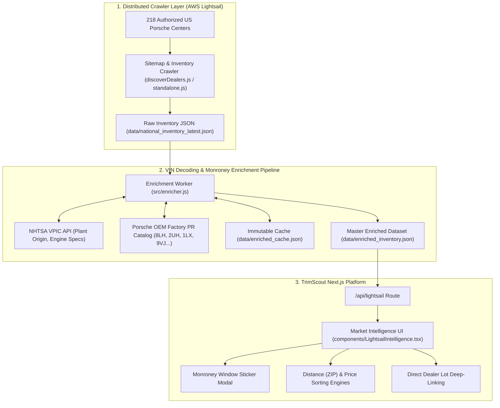

# TrimScout Project Knowledge Base & Architecture

> **Comprehensive Reference**: TrimScout Luxury Automotive Marketplace & Intelligence Platform  
> **Framework**: Next.js 14 (App Router) + React + TailwindCSS + Lucide Icons  
> **Crawler Infrastructure**: AWS Lightsail (`34.205.155.92`), Ubuntu 24.04 LTS, Node.js + Python

---

## 🏛️ System Architecture



---

## 📁 Repository Structure

```
TrimScout/
├── app/
│   ├── layout.tsx              # Root layout with navigation and font configs
│   ├── page.tsx                # Main home view integrating Lightsail Intelligence
│   ├── admin/                  # Protected admin dashboard for fleet management
│   ├── api/
│   │   ├── lightsail/route.ts  # Endpoint serving enriched nationwide vehicle feed
│   │   └── inventory/route.ts  # Auxiliary inventory search endpoint
├── components/
│   ├── LightsailIntelligence.tsx # Core market intelligence interface & filter suite
│   ├── FeeBreakdownModal.tsx   # Detailed dealer fee and closing cost calculator
│   ├── DealRoom.tsx            # Buyer transaction and reservation management
│   ├── Navigation.tsx          # Top navbar with quick navigation and auth trigger
│   └── MonroneyModal.tsx       # Factory build sheet & window sticker popup
├── lib/
│   ├── enrichmentEngine.ts     # PR code definitions, option tags, Monroney calculator
│   ├── scrapers/               # Multi-platform dealer scraper resolver
│   │   ├── dealerLinker.ts     # Direct VDP link generator
│   │   └── index.ts            # Aggregator for dealer web endpoints
│   └── zipCoordinates.ts       # US ZIP code centroid dataset for radius sorting
├── scrapers/
│   └── lightsail-crawler/      # Standalone Lightsail / Apify crawler package
│       ├── src/
│       │   ├── standalone.js   # Main crawler orchestration script
│       │   ├── discoverDealers.js # 218 dealership domain discovery engine
│       │   ├── enricher.js     # NHTSA + Porsche PR option enrichment engine
│       │   └── dashboard.js    # CLI terminal dashboard and progress reporter
│       ├── dealers.json        # 218 verified US Porsche Center domains & metadata
│       └── deploy.sh           # 1-click sync and deploy script to AWS Lightsail
├── data/                       # Enriched datasets and cache files
│   ├── enriched_inventory.json # Master enriched Porsche vehicle inventory
│   └── enriched_cache.json     # Immutable VIN decoding cache
├── docs/                       # Project documentation & conversation history
│   ├── CONVERSATION_HISTORY.md # Detailed digest of all prior sessions
│   └── PROJECT_KNOWLEDGE_BASE.md # Architecture and operational playbook
├── scripts/
│   └── generate_pitch_deck.js  # Automated 16:9 PowerPoint pitch deck generator
└── public/
    └── TrimScout_Business_Case_Pitch_Deck.pptx # Commercial pitch deck artifact
```

---

## 🏎️ Porsche Factory Options & PR Catalog

The enrichment engine cross-references scraped descriptions and specifications against official Porsche Option PR codes:

| PR Code | Option Name | Category | Standard Add MSRP |
| :--- | :--- | :--- | :--- |
| **`8LH`** | Sport Chrono Package (Mode Switch + Precision App) | Performance | \$2,790 |
| **`2UH`** | Front Axle Lift System | Performance | \$2,980 |
| **`1LX`** | Porsche Ceramic Composite Brakes (PCCB) | Performance | \$8,970 |
| **`9VJ`** | Burmester® High-End 3D Surround Sound System | Audio & Tech | \$5,560 |
| **`0P9`** | Sport Exhaust System (Dual Tailpipes) | Performance | \$2,950 |
| **`Q1J`** | Adaptive Sports Seats Plus (18-Way, Electric) | Interior | \$2,820 |
| **`1P7`** | Porsche Dynamic Chassis Control Sport (PDCC) | Performance | \$3,170 |
| **`0N5`** | Rear Axle Steering | Performance | \$2,090 |
| **`8IS`** | LED Headlights with PDLS+ | Exterior | \$1,270 |
| **`VR4`** | SportDesign Side Skirts | Exterior | \$1,290 |

---

## ⚡ AWS Lightsail Crawler Operations

- **Host**: `34.205.155.92` (User: `admin`)
- **SSH Command**: `ssh lightsail`
- **Remote Directory**: `/home/admin/porsche-tracker`
- **Deploying Updates**:
  ```bash
  cd /Users/paul/Documents/TrimScout/scrapers/lightsail-crawler
  ./deploy.sh
  ```
- **Running a Fresh Crawl on Lightsail**:
  ```bash
  ssh lightsail "cd /home/admin/porsche-tracker && node src/standalone.js"
  ```
- **Running VIN Enrichment on Lightsail**:
  ```bash
  ssh lightsail "cd /home/admin/porsche-tracker && node src/enricher.js"
  ```
